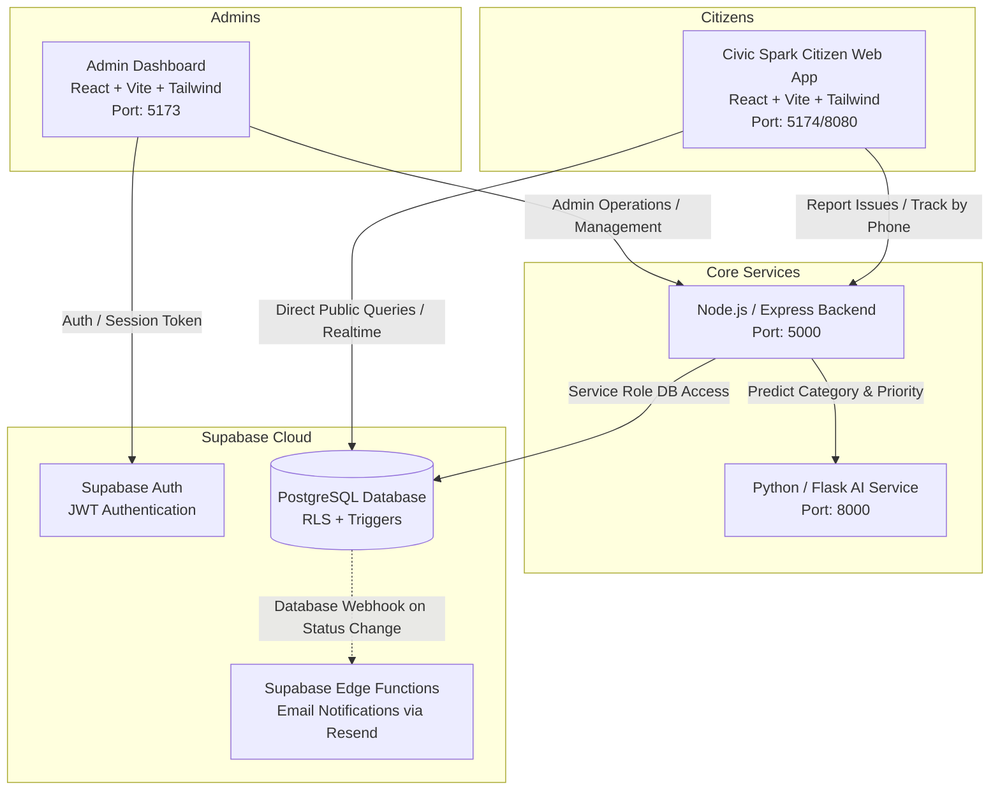

# 🏛️ Civic Sense Platform ("Fix It Now")

> **A Comprehensive, AI-Powered Citizen Grievance Redressal and Municipal Operations Management Platform**

---

## 📑 Table of Contents
1. [Project Overview & Architecture](#-project-overview--architecture)
2. [Key Features & Capabilities](#-key-features--capabilities)
3. [Technology Stack & Port Allocation](#-technology-stack--port-allocation)
4. [Master Credentials & System Accounts](#-master-credentials--system-accounts)
5. [Complete Installation & Setup Guide (New Computer)](#-complete-installation--setup-guide-new-computer)
6. [Supabase Database Setup & Schema Guide](#-supabase-database-setup--schema-guide)
7. [Environment Variables Configuration (`.env`)](#-environment-variables-configuration-env)
8. [How to Run the Application](#-how-to-run-the-application)
9. [Detailed Repository Structure](#-detailed-repository-structure)
10. [REST API Documentation & Endpoints](#-rest-api-documentation--endpoints)
11. [How the AI Priority Model Works](#-how-the-ai-priority-model-works)
12. [Role-Based Access Control & Jurisdiction Logic](#-role-based-access-control--jurisdiction-logic)
13. [Troubleshooting & Frequently Asked Questions](#-troubleshooting--frequently-asked-questions)

---

## 🌟 Project Overview & Architecture

**Fix It Now (Civic Sense)** bridges the gap between citizens and local municipal governments. Citizens can report civic issues (potholes, garbage, waterlogging, broken streetlights) with photos, voice description, and GPS coordinates. The report is automatically analyzed by a Python Machine Learning service that assigns categories and priority levels (Low, Medium, High, Critical). Municipal administrators receive the complaints filtered strictly by their assigned postal codes (jurisdiction) and manage resolutions in real-time.



---

## 🚀 Key Features & Capabilities

### 1. Citizen Portal (`civic-spark`)
* **Issue Reporting with Geolocation**: Capture exact GPS location using Leaflet interactive maps or device geolocation.
* **Photo Upload**: Attach photographic evidence stored in base64 / cloud storage.
* **Voice-to-Text Speech Recognition**: Built-in speech recognition for accessibility in multiple languages.
* **Track by Phone & OTP**: Citizens can track all complaints linked to their phone number with OTP verification.
* **Public Impact & Analytics Dashboard**: Real-time charts (Recharts) displaying resolution rates, categories, and city-wide progress.
* **Multi-Language Support**: Complete language switching (English, Hindi, Marathi, etc.) powered by React Context.
* **Civic Blogs & Case Studies**: Read educational civic programs, cleanliness drives, and policy announcements.

### 2. Admin Dashboard (`admin-dashboard`)
* **Dual-Tier Role System**:
  * **Master Admin**: Full oversight across all municipalities, user management, municipal admin onboarding, issue deletion, and blog CMS.
  * **Municipal Admin**: Restrictive access strictly filtered by designated district postal codes (`district_code` pincodes).
* **Interactive Issue Resolution Workflow**: Update status (`open` ➔ `in_progress` ➔ `resolved` / `rejected`) and adjust priority.
* **Municipal Admin Provisioning**: Master admins can generate municipal officer accounts directly through the UI.
* **Integrated Blog CMS**: Create, edit, preview, and publish civic news directly from the dashboard.

### 3. AI NLP Priority Prediction Service (`ai-service`)
* Python microservice powered by **Scikit-Learn**, **TF-IDF Vectorization**, and **Joblib**.
* Parses citizen descriptions and dynamically predicts priority: `low`, `medium`, `high`, or `critical`.
* Rule-based override layer for life-threatening keywords (e.g., live electrical wires, gas leaks, collapsed bridges).

### 4. Robust Backend API (`backend`)
* Node.js & Express REST architecture with Supabase Service Role integration.
* JWT verification middleware resolving custom roles and postal jurisdiction from `public.users`.
* Anonymous reporting fallback mechanism (`DUMMY_REPORTER_ID`).

---

## 💻 Technology Stack & Port Allocation

| Component | Technology | Default Port | Default URL |
| :--- | :--- | :--- | :--- |
| **Backend API** | Node.js, Express, `@supabase/supabase-js`, Axios, Dotenv | `5000` | `http://localhost:5000` |
| **AI Microservice** | Python 3, Flask, Scikit-Learn, Pandas, NLTK, Joblib | `8000` | `http://localhost:8000` |
| **Admin Dashboard** | React 18, Vite, TypeScript, TailwindCSS, Radix UI, Lucide | `5173` | `http://localhost:5173` |
| **Civic Spark (Citizen Web)** | React 18, Vite, TypeScript, TailwindCSS, Leaflet, Recharts | `5174` (or `8080`) | `http://localhost:5174` |
| **Database & Auth** | Supabase (PostgreSQL, GoTrue Auth, Storage, Edge Functions) | Cloud | `https://your-project-id.supabase.co` |

---

## 🔑 Master Credentials & System Accounts

### 👑 Master Admin Account (For Admin Dashboard)
* **Login URL**: `http://localhost:5173/login`
* **Email**: `admin@fixitnow.com`
* **Password**: `Admin12345!`
* **Role**: `master_admin`

> 💡 **Need to create or reset a Master Admin?** Run:
> ```powershell
> node backend/create_master_admin.js <email> <password> "<Full Name>"
> ```

### 👤 Anonymous Citizen System ID
* **UUID**: `14015746-53d5-4719-9c3e-bbc18a88fba8`
* **Purpose**: Used automatically by the backend when an unregistered citizen reports an issue without authenticating.

---

## 🛠️ Complete Installation & Setup Guide (New Computer)

Follow these exact steps to run this project on any new machine.

### Prerequisites
* **Node.js**: `v18.0.0` or newer ([Download Node.js](https://nodejs.org/))
* **Python**: `3.9` to `3.12` ([Download Python](https://www.python.org/))
* **Git**: ([Download Git](https://git-scm.com/))
* **PowerShell** (Default on Windows) or Bash (macOS/Linux)

---

### Step 1: Clone the Repository
```bash
git clone <your-repository-url>
cd "Fix It Now"
```

---

### Step 2: Install Backend Dependencies
```bash
cd backend
npm install
cd ..
```

---

### Step 3: Set Up Python AI Service
```bash
cd ai-service

# Create virtual environment
python -m venv venv

# Activate virtual environment
# On Windows PowerShell:
.\venv\Scripts\Activate.ps1
# On macOS/Linux:
# source venv/bin/activate

# Install requirements
pip install -r requirements.txt

cd ..
```

---

### Step 4: Install Admin Dashboard Dependencies
```bash
cd admin-dashboard
npm install
cd ..
```

---

### Step 5: Install Civic Spark (Citizen App) Dependencies
```bash
cd civic-spark
npm install
cd ..
```

---

## 🗄️ Supabase Database Setup & Schema Guide

If setting up a brand new Supabase project:
1. Log in to [Supabase](https://supabase.com/dashboard) and click **New Project**.
2. Navigate to the **SQL Editor** in the left menu.
3. Click **New query**, paste the entire content of [`supabase_complete_setup.sql`](file:///s:/Fix%20It%20Now/supabase_complete_setup.sql), and click **RUN**.

### Summary of Created Tables:

#### 1. `public.municipalities`
Stores municipal administrative divisions.
* `id` (UUID, Primary Key)
* `name` (TEXT) - e.g. "Pune Municipal Corporation"
* `ward_code` (TEXT, Unique) - e.g. "PUNE-411"
* `created_at` (TIMESTAMPTZ)

#### 2. `public.users`
Extends `auth.users` with civic roles and jurisdiction data.
* `id` (UUID, References `auth.users.id` ON DELETE CASCADE)
* `role` (TEXT) - `'citizen'`, `'municipal_admin'`, `'master_admin'`
* `full_name` (TEXT)
* `phone_number` (TEXT)
* `district_code` (TEXT) - Comma-separated postal pincodes assigned to municipal admins (e.g. `"411001,411002,411021"`)
* `aadhar_status` (TEXT) - `'pending'`, `'verified'`, `'rejected'`
* `municipality_id` (UUID, References `public.municipalities.id`)
* `created_at` (TIMESTAMPTZ)

#### 3. `public.issues`
Stores all reported citizen complaints.
* `id` (UUID, Primary Key)
* `title` (TEXT)
* `description` (TEXT)
* `location_lat` / `location_lng` (DOUBLE PRECISION)
* `address` (TEXT)
* `image_url` (TEXT)
* `status` (TEXT) - `'open'`, `'in_progress'`, `'resolved'`, `'rejected'`
* `priority` (TEXT) - `'low'`, `'medium'`, `'high'`, `'critical'`
* `reporter_id` (UUID, References `public.users.id`)
* `reporter_name`, `reporter_phone`, `reporter_aadhar` (TEXT)
* `district_code` (TEXT) - Derived from the reported pincode for municipal filtering
* `ai_category` (TEXT), `ai_confidence` (DOUBLE PRECISION)
* `created_at`, `updated_at` (TIMESTAMPTZ)

#### 4. `public.blogs`
Stores civic news and announcement articles.
* `id` (UUID, Primary Key)
* `title` (TEXT), `excerpt` (TEXT), `content` (TEXT), `image_url` (TEXT)
* `category` (TEXT), `author_name` (TEXT), `read_time` (TEXT)
* `created_at` (TIMESTAMPTZ)

---

## ⚙️ Environment Variables Configuration (`.env`)

Ensure the `.env` files are configured in each respective directory:

### 1. `backend/.env`
```env
PORT=5000
SUPABASE_URL=https://your-project-id.supabase.co
SUPABASE_ANON_KEY=your-supabase-anon-key
SUPABASE_SERVICE_ROLE_KEY=your-supabase-service-role-key
```

### 2. `civic-spark/.env`
```env
VITE_SUPABASE_URL=https://your-project-id.supabase.co
VITE_SUPABASE_ANON_KEY=your-supabase-anon-key
```

### 3. `admin-dashboard/.env`
```env
VITE_SUPABASE_URL=https://your-project-id.supabase.co
VITE_SUPABASE_ANON_KEY=your-supabase-anon-key
```

---

## 🚀 How to Run the Application

### Option A: One-Click Startup (PowerShell)
From the repository root:
```powershell
.\start_services.ps1
```

---

### Option B: Manual Multi-Terminal Startup

Open 4 separate terminal windows:

#### Terminal 1: Backend API
```powershell
cd backend
node index.js
# Running on http://localhost:5000
```

#### Terminal 2: AI Microservice
```powershell
cd ai-service
# Activate venv if needed: .\venv\Scripts\Activate.ps1
python app.py
# Running on http://localhost:8000
```

#### Terminal 3: Admin Dashboard
```powershell
cd admin-dashboard
npm run dev
# Running on http://localhost:5173
```

#### Terminal 4: Citizen Web App (Civic Spark)
```powershell
cd civic-spark
npm run dev
# Running on http://localhost:5174 or http://localhost:8080
```

---

## 📂 Detailed Repository Structure

```
Fix It Now/
│
├── start_services.ps1             # PowerShell script to launch backend, AI service & dashboard
├── supabase_complete_setup.sql    # Standalone master SQL script for Supabase database setup
├── README.md                      # Comprehensive project documentation
├── test_api.js                    # Utility script to test issue reporting endpoint
│
├── backend/                       # Node.js & Express REST API Server
│   ├── .env                       # Backend environment variables
│   ├── index.js                   # Express server entry point & route mounting
│   ├── supabaseClient.js          # Supabase Client initialization with Service Role
│   ├── create_master_admin.js     # CLI utility to create/promote master admin users
│   ├── test_db.js                 # DB connection and table count diagnostic tool
│   ├── package.json               # Backend dependencies
│   ├── middleware/
│   │   └── authMiddleware.js      # JWT verification & role extraction middleware
│   └── routes/
│       ├── issues.js              # Issue CRUD, AI dispatch, jurisdiction filtering
│       ├── admin.js               # Municipal admin creation & management
│       ├── blogs.js               # Blog article management
│       └── otp.js                 # OTP generation & validation for citizen login
│
├── ai-service/                    # Python Flask Machine Learning Service
│   ├── app.py                     # Flask API entry point (Port 8000)
│   ├── model.py                   # NLP priority classification logic & hybrid overrides
│   ├── requirements.txt           # Python dependencies
│   ├── civic_priority_model.pkl   # Serialized Scikit-learn Classifier
│   ├── tfidf_vectorizer.pkl       # Serialized TF-IDF feature extractor
│   ├── label_encoder.pkl          # Serialized label encoder for classes
│   └── DataSet.csv                # Training dataset for civic issue categorization
│
├── admin-dashboard/               # React + Vite Admin Dashboard (Master & Municipal)
│   ├── .env                       # Frontend Supabase keys
│   ├── index.html                 # HTML Entry point
│   ├── src/
│   │   ├── App.tsx                # React Router setup for /master and /municipal
│   │   ├── layouts/
│   │   │   ├── AuthLayout.tsx     # Login screen wrapper
│   │   │   ├── MasterLayout.tsx   # Master admin sidebar, header & navigation
│   │   │   └── MunicipalLayout.tsx# Municipal admin sidebar & navigation
│   │   ├── pages/
│   │   │   ├── auth/Login.tsx     # Supabase Auth Login screen
│   │   │   ├── master/            # Master Admin Pages
│   │   │   │   ├── Dashboard.tsx  # Overview metrics, charts & resolution rates
│   │   │   │   ├── Issues.tsx     # Global issue triage table & filters
│   │   │   │   ├── IssueDetails.tsx# Single issue inspection & status updater
│   │   │   │   ├── MunicipalAdmins.tsx # Create & manage municipal officer accounts
│   │   │   │   ├── Users.tsx      # View registered users
│   │   │   │   └── Blogs.tsx      # Blog CMS (Create/Edit/Delete)
│   │   │   └── municipal/         # Municipal Admin Pages
│   │   │       ├── Dashboard.tsx  # Jurisdiction-specific metrics
│   │   │       ├── AssignedIssues.tsx # Issues matching officer's district pincodes
│   │   │       └── ResolutionAction.tsx # Update issue status & upload resolution proof
│   │   └── lib/
│   │       └── supabaseClient.ts  # Browser Supabase client
│
├── civic-spark/                   # React + Vite Citizen Web Application
│   ├── .env                       # Frontend Supabase keys
│   ├── index.html                 # HTML Entry point
│   ├── src/
│   │   ├── App.tsx                # Citizen app routing
│   │   ├── contexts/
│   │   │   └── LanguageContext.tsx# Multilingual translation provider
│   │   ├── pages/
│   │   │   ├── Index.tsx          # Homepage with Hero, Quick Actions & Live Stats
│   │   │   ├── ReportIssue.tsx    # Complaint reporting flow (Voice, Map, Image)
│   │   │   ├── TrackIssues.tsx    # Phone OTP lookup & status tracker
│   │   │   ├── Impact.tsx         # City-wide statistics & analytics charts
│   │   │   ├── Blog.tsx           # Civic news articles list
│   │   │   ├── BlogArticle.tsx    # Detailed blog post viewer
│   │   │   └── programs/          # Community program pages (CleanCity, Traffic, etc.)
│   │   └── components/
│   │       ├── home/              # HeroSection, CategoryGrid, RecentReports
│   │       ├── MapPicker.tsx      # Leaflet interactive GPS map selector
│   │       └── ThemeToggle.tsx    # Light / Dark mode switcher
│
└── supabase/                      # Supabase Edge Functions & Webhooks
    └── functions/
        └── notify-status-change/  # Webhook function to trigger Resend email notifications
            └── index.ts
```

---

## 📡 REST API Documentation & Endpoints

### 1. Issues (`/api/issues`)
* `POST /api/issues` — Submit a new issue report (Public / Optional Auth). Automatically contacts AI model.
* `GET /api/issues` — Fetch issues (Protected). If logged in as Municipal Admin, automatically filters by user's `district_code` pincodes.
* `GET /api/issues/:id` — Fetch single issue by ID (Protected).
* `GET /api/issues/citizen/:phone` — Fetch all complaints reported by a given phone number (Public).
* `PATCH /api/issues/:id` — Update issue status (`open`, `in_progress`, `resolved`, `rejected`) or priority (Protected).
* `DELETE /api/issues/:id` — Permanently delete an issue (Master Admin only).

### 2. Admin & Officers (`/api/admin`)
* `POST /api/admin/municipal` — Create a new Municipal Admin in Supabase Auth and `public.users` with assigned pincodes (Master Admin only).
* `GET /api/admin/municipal` — List all registered Municipal Admins (Master Admin only).
* `DELETE /api/admin/municipal/:id` — Delete a Municipal Admin account (Master Admin only).

### 3. Blogs (`/api/blogs`)
* `GET /api/blogs` — List all published blog articles (Public).
* `GET /api/blogs/:id` — Fetch single blog article by ID (Public).
* `POST /api/blogs` — Publish a new article (Master Admin only).
* `PUT /api/blogs/:id` — Update an existing article (Master Admin only).
* `DELETE /api/blogs/:id` — Delete an article (Master Admin only).

### 4. OTP Verification (`/api/otp`)
* `POST /api/otp/send` — Send OTP to citizen phone number.
* `POST /api/otp/verify` — Verify citizen phone OTP.

### 5. AI Service (`/predict` on Port 8000)
* `POST /predict` — Accepts JSON `{ "description": "text" }` and returns `{ "priority": "high", "confidence_scores": {...} }`.

---

## 🧠 How the AI Priority Model Works

The AI service uses natural language processing to evaluate citizen grievances:
1. **Text Preprocessing**: Lowercasing, punctuation stripping, tokenization, and stop-word removal.
2. **TF-IDF Vectorization**: Transforms words into numerical feature weights based on urgency corpus.
3. **Machine Learning Classifier**: Trained model classifies the complaint into `low`, `medium`, `high`, or `critical`.
4. **Hybrid Safety Override**: Critical keywords (e.g. *"sparking wire"*, *"gas leak"*, *"bridge collapse"*, *"open manhole"*) automatically trigger an immediate override to **`critical`** or **`high`** priority regardless of model confidence.

---

## 🔒 Role-Based Access Control & Jurisdiction Logic

* **Citizens**: Can report issues anonymously or with phone number, view public impact stats, and track their complaints.
* **Municipal Admins**: When a Municipal Admin logs in:
  1. The JWT token is decoded by `authMiddleware.js`.
  2. The server queries `public.users` for their `district_code` (e.g., `"411001, 411002, 411044"`).
  3. All database queries for `/api/issues` apply `.in("district_code", pincodes)` so officers only ever see issues occurring inside their jurisdiction.
* **Master Admins**: Possess global privileges across all pincodes, can manage users, create officers, and delete content.

---

## ❓ Troubleshooting & Frequently Asked Questions

### Q1: The backend says `supabaseUrl is required` or fails to connect?
**Answer**: Make sure [backend/.env](file:///s:/Fix%20It%20Now/backend/.env) contains valid `SUPABASE_URL`, `SUPABASE_ANON_KEY`, and `SUPABASE_SERVICE_ROLE_KEY`. Run `node backend/test_db.js` to verify your database connection.

### Q2: What if my Supabase project is paused or deleted after inactivity?
**Answer**:
1. Create a new Supabase project at [supabase.com](https://supabase.com).
2. Open the SQL Editor and execute [`supabase_complete_setup.sql`](file:///s:/Fix%20It%20Now/supabase_complete_setup.sql).
3. Copy the new Project URL, Anon Key, and Service Role Key into `backend/.env`, `civic-spark/.env`, and `admin-dashboard/.env`.
4. Run `node backend/create_master_admin.js admin@fixitnow.com Admin12345! "Master Admin"`.

### Q3: Python AI Service shows `ModuleNotFoundError`?
**Answer**: Activate your virtual environment and install the dependencies:
```powershell
cd ai-service
.\venv\Scripts\Activate.ps1
pip install -r requirements.txt
python app.py
```

### Q4: Port 5000 or 8000 is already in use?
**Answer**:
In PowerShell, find and kill the process holding the port:
```powershell
Get-Process -Id (Get-NetTCPConnection -LocalPort 5000).OwningProcess | Stop-Process -Force
```

---

*Civic Sense Platform — Empowering Citizens & Streamlining Municipal Governance.*
